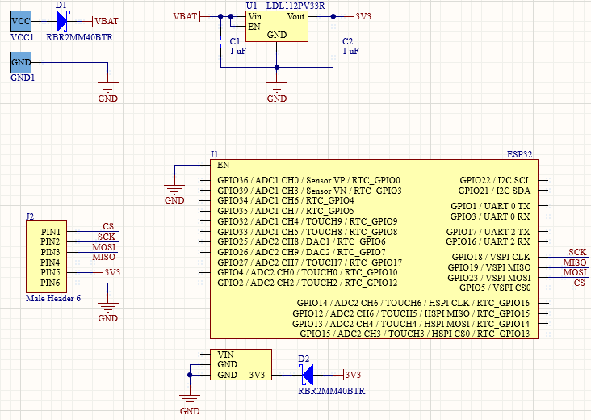

# Tractian Challenge

 * [Understanding the Challenge](#challenge)
 * [Starting Ideas](#ideas)
    * [Analyzing the Starting Ideas](#analyzing)
    * [Choosing the Protocol](#protocol)
 * [Developing the Hardware](#hardware)
    * [Power Supply](#supply)
    * [ESP32 Circuity](#esp32)
    * [Bill of Materials](#bom)
    * [Thermal Understanding](#thermal)
 * [Developing the Firmware](#firmware)
 * [Conclusion](#conclusion)
 * [Images of the System](#images)

## Understanding the Challenge
The main objective of the challenge is develop a full wireless communication system, sending 500kB file from 100 meters open air-gap, using at least one battery powered device.

So we are breaking this challenge in some small objectives, as follow:
- **Full Wireless System** 
- **Data Size: 500kBytes**
- **Minimum Distance: 100 meters**
- **Powered by: LiPo Battery**

## Starting Ideas
In the beginning of the development three ideas come in mind, based in my experience as a developer:
- **ESP32 Wi-Fi (ESPNOW)**
- **LoRaWAN**

### Analyzing the Starting Ideas
Looking the specifications of each communication technique we can instantly see some pro and cons of each one. 

ESP32 Wi-Fi is known as a fast communication protocol, only used with a single emitter an a single receiver, don't allowing communication with multiples devices. This protocol has a maximum distance of 300 meters, which accomplish one of the objectives. But it can only be used to exchange small packs of information, up to 250 bytes. This protocol can be used if we build in firmware a system to divide the file in small packs of information and send them in chuncks. It will take some time but in the end all the bytes would been exchanged.

LoRaWAN, mainly used in IoT applications, communicating in a 10 kilometers area, which accomplish one of ours objectives. But in the same way as the ESP32, this protocol can only exchange packs of information, up to 256 bytes. The main problem of this solution is the small data rate, which will slow down all the communication.

Comparing this two options, for the scope of the challenge, the ESP32 application is the best between them. Because, both of them have a nice response in 100 meters, both of them are a wireless application, both of them can be used in low power and powered by an battery source, both of them can exchange the 500kBytes file, but the data rate is the main difference. LoRaWAN has a 50kbps data rate, and ESP32 has a 150Mbps, this difference will interfere in the final communicating time.

### Choosing the Protocol
For this challenge I will use the ESP32 Wi-Fi approach, mainly to optimize the communication time. If we need more communication distance, the LoRaWAN approach would be best fitted.

## Developing the Hardware
Now the protocol is set, it's needed to define some requirements, such as:
- **Battery connection by pad suitable for a 18AWG cable**
- **3.3V linear voltage regulator**
- **Reverse polarity protection in the battery supply**
- **Protection diode in all supply inputs and outputs of the ESP32**
- **SD Card port**

### Power Supply
I'm using linear voltage regulators, mainly for the simplicity of this application in terms of voltage and low current consumption. If we were using more current, or high voltage dropout the buck converter would be best fitted. In this application the voltage dropout will be of: 4.2V - 3.3V = 0.9V
The IC used is the **LDL112PV33R**, it has the 10 year longevity commitment by ST Microeletronics. With this certification, we have the guarantee of having this IC until 2030. The first idea was using the **LDL1117S33R**, this IC is still active and beeing produced in large scale, but we don't have any kind of guarantee of the longevity of the IC, so we rather use a safer one.
In terms of polarity protection, I'm using an schottky diode, with max values of 40V and 2A. With this system we have a simple circuit, and a small package, if we want to have an on/off system, it's easy to implement, simply changing the diode by a MOSFET and a dip, in this case we use more space in the board.

### ESP32 Circuity
To simplify the system and guarantee a kick way of test and prototype all the device, I will use the **ESP32 Dev Kit 1**. But the interface between the board and the ESP will be two female 15 pin header, with diode in each supply port. It will not allow the incorrect flow of current.
In one of my projects I connected the ESP32 with 5V, which is the normal, but I noticed that the 3.3V regulator overheated sometimes, so based on that I supply the ESP32 directly with 3.3V. To keep the protection of all the board, I disable thee internal regulator of the ESP32 module.
As explained in the beginning it's needed to send a 500Kb file, so I will use a SD Card to store the file, communicate by SPI with the ESP32, and them send the file using the ESPNOW protocol.

### Bill of Materials
To develop it's needed the following components:
- **2x Schottky Diode such as RBR2MM40BTR**
- **1x Linear Voltage Regulator such as LDL112PV33R**
- **2x SMD 0603 Capacitor of 0.1uF**
- **2x 15 pin Female Header**
- **1x ESP32 Devkit V1**

### Thermal Understanding
Finishing the hardware part of the development it's required an simple thermal analysis. First it's needed to analyse the main power dissipation points. In this case it will be the Linear Voltage Regulator. It's known the potency in the regulator wich will be:
**P=I.V=0,5*0,9=0,45W=450mW**
Now it's needed the Thermal Resistance Junction to Ambient constant of the IC. Wich in this case is 55 Celsius per watt. So to the final temperature will be:
**TIC=Tamb+T=Tamb+(0,45*55)=Tamb+24,75**
So if the product is installed in São Paulo, with a annual average ambient temperature of 20 Celsius, the Ic temperature will be:
**T=20+24,75=44,75**
So we don't have an overheated system.

## Developing the Firmware
Since the beginning of the project, I search for some references to build my idea. In this research I found a git hub repository, that implement a similar application. The firmware was inspired in a application developed by Sebastian Arboleda D. His repository was for extremely help because it give me some guidelines.

So I used a firmware really similar as Sebastian one, who made a full wireless communication of a 500Kb file in less than 5 minutes, so using something similar I guarantee the full functionality of the firmware, mainly because I don't have a ESP32 to test the system. So I try to guarantee that the system would be operational by the end of the develop time, and this approach was the better i could find.

Explaining the idea of the firmware, was divide the full file in chunks, get the right bytes by the SPI extracting the data of the SD Card, and send by the ESPNOW protocol. In this case the file that is going to be send has to have a certain name, in this case will be Communicate.txt.

The repository link used in this part is: **https://github.com/sebaz143/TRACTIAN\_RadioFileTransfer**

## Conclusion
After all the development, I notice some new applications that I never think about. The communication in ESPNOW in chunks was something new for me. So I thank Sebastian for all the documentation he made, it was really help full.
To make the develop of the product, I take the liberty to make a 3D case for it.

